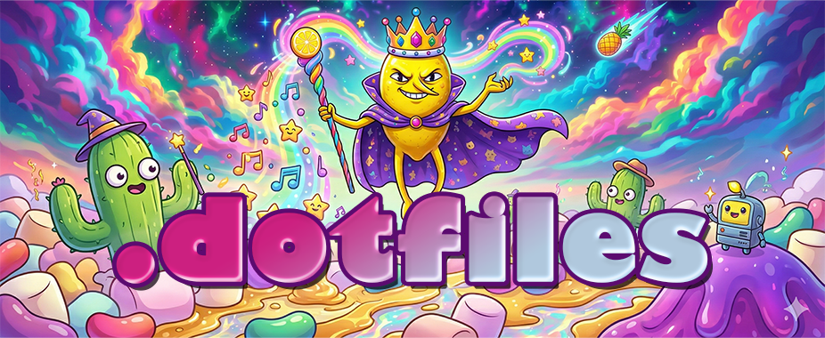

<p align="center">
  
</p>

<p align="center">
  
  
</p>

Opinionated terminal setup for my personal machines. This is public because there's nothing secret here, but it's built entirely around my own preferences. Steal whatever you want.

## Development workflow

Work directly on `main`. Don't create feature branches, worktrees, or pull requests. Start with a clean checkout; if it isn't clean, finish or resolve that work first. Commit every finished change and push `main`. Don't leave dirty files behind.

## Quick setup

SSH into any box, run this, and you're home:

```bash
curl -fsSL "https://raw.githubusercontent.com/lemonsaurus/dotfiles/main/setup.sh?$(date +%s)" | bash
```

This installs zsh (set as default shell), starship, zsh plugins, eza, and bat, then drops all configs into place. `~/.zshrc` sources `~/.zshrc.local` for settings that belong to one machine. On GNOME it installs and enables the Bigscreen Notifications and Smile Summon extensions, which load at next login. On WSL it also installs the Rio, winghostty, and Wintty configs on the Windows side.

Restart your terminal (or run `zsh`) and you're good to go.

## What's in here

- **Starship prompt** config with Catppuccin Mocha theme and powerline-style segments
- **Zsh** config with autosuggestions, syntax highlighting, directory jumping, and aliases for `eza`/`bat`
- **Bigscreen Notifications** GNOME Shell extension that shows notification banners in the bottom right of the largest monitor, without making it primary
- **Smile Summon** GNOME Shell extension that toggles the [Smile](https://github.com/mijorus/smile) emoji picker at the pointer with `Super+.`
- **Rio terminal** config and Electron Highlighter color theme (for WSL)
- **winghostty** config with AltGr workarounds and Norwegian dead-key fixes (for WSL)
- **Wintty** config, plus scripts that build [deblasis/wintty](https://github.com/deblasis/wintty) from source with a borderless-window patch and a rainbow icon (for WSL)

## Wintty

Wintty is a Windows build of Ghostty (WinUI 3, DirectX 12). There's no public binary, so `wintty/` builds it on the Windows side from WSL:

```bash
wintty/install.sh   # once per machine: Git, Zig, .NET 10, VS Build Tools, uv, then the first build
wintty/update.sh    # whenever: pull upstream, re-apply the patch and icon, rebuild, reinstall
```

The source lives in `%LOCALAPPDATA%\wintty-src` and the app in `%LOCALAPPDATA%\Programs\Wintty`, with a Start menu shortcut. If Wintty is open, `update.sh` installs the new build once every Wintty window is closed.

- `undecorated.patch` makes `window-decoration = none` hide the tab strip, title bar, caption buttons, and pane borders. When upstream moves under it, `update.sh` stops at the patch step.
- `make_icon.py` renders the icon masters that Wintty's build turns into the `.ico` and PNG assets.

## Font

The starship config expects [MesloLGS Nerd Font](https://github.com/ryanoasis/nerd-fonts/releases/latest). Install it on your host OS — your local terminal handles the font rendering, so remote boxes don't need it.
